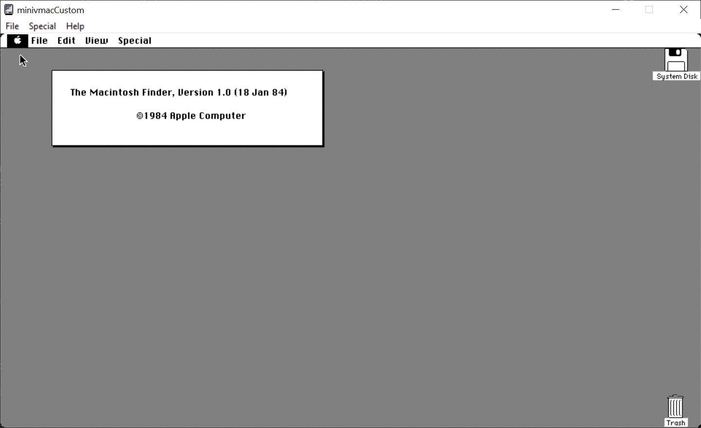
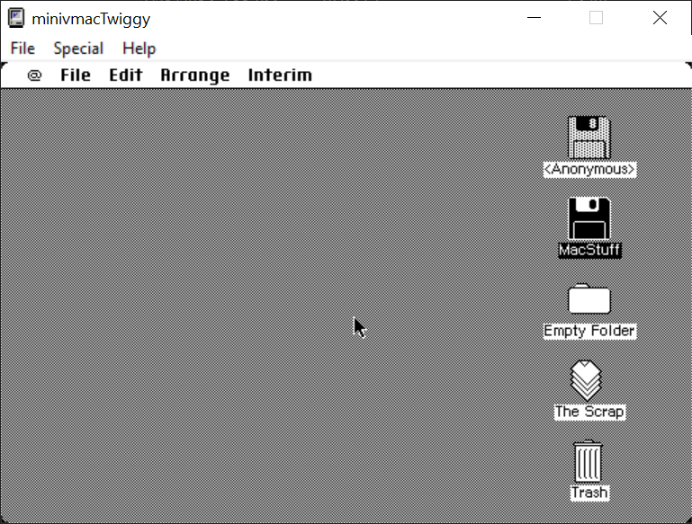

# Mini vMac custom builds
## Overview
This is all of mybuilds of Mini vMac. Currently, the builds are for Linux x86-64, and Windows x86-64. I do plan on making Mac builds soon.

## Compile settings

I built the Linux builds within Termux. I built Windows builds using `mingw-w64` inside Ubuntu 20.04.4 (LTS) inside WSL1 on Windows 10 Pro 1809 (Because Void isn't on WSL yet,too bored on setting up a VM.)

I used the stable branch (which is, ahem, 4 years old at this point), version 36.04.

The builds are made using `gcc` or `mingw-w64`. More platforms are in the future.

## Custom builds

Custom builds of the emulator includes 128k, Plus and Mac II. Features of these builds include higher definitions (960x540, half 1920x1080) and higher color depth for Mac II builds.

## How to compile

You can compile Mini vMac by following the [guide here](https://www.gryphel.com/c/minivmac/build.html) and type `make` to compile it.

## Contributions & Legal

Mini vMac is licensed under the terms of GNU GPLv2.

All ROM files needed for Mini vMac is under Apple's copyright, and you must either dump it yourself or search online for it.

If you want to contribute, you can create a pull request, or point something wrong by creating an issue. I do'nt accept emulation problems, as I don't have knoweldge about the C language. I could do is help you with compiling.

## Screenshots

 with half 1080p")

")

